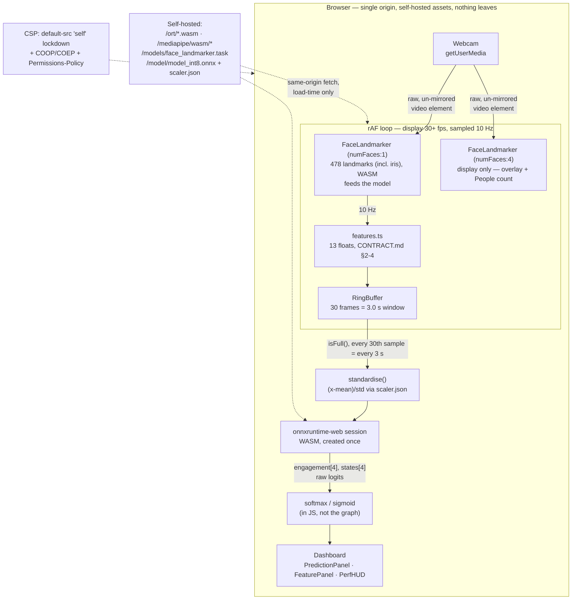

# Privacy-Preserving Cognitive State Detection in the Browser

Final-year project: detecting learner engagement and cognitive states from
webcam video, with **all inference running client-side** — video never leaves
the user's machine. A small temporal convolutional network is trained on the
DAiSEE dataset, quantized to int8 ONNX (~60 KB), and executed in the browser
with onnxruntime-web on features extracted by MediaPipe Face Mesh.

- **Track A** (this repo's `ml/`): DAiSEE video → features → trained,
  quantized ONNX model — Bilal
- **Track B** (`web/`): Next.js app, in-browser feature extraction and
  inference, benchmarking — Azeem

**`CONTRACT.md` is the interface contract between the two tracks. Read it
first.**

## Architecture (Track B — everything below runs in the browser)



No server, no CDN, no third-party origin: `next.config.mjs` ships a
full CSP lockdown (`default-src 'self'` with `connect-src 'self'`, plus
`Permissions-Policy: camera=(self)`, COOP/COEP), which makes cross-origin
requests fail closed at the browser level regardless of what any
dependency tries to do — see `docs/privacy.md` for why that header exists
and the real telemetry call it blocks. Stage-by-stage breakdown (file
references, timing, and the two production-build fixes that shaped this
design) in `docs/architecture.md`.

## Repository layout

```
CONTRACT.md            interface contract (source of truth)
.github/workflows/     CI — vitest/typecheck/pytest always; J1 gate when its fixture is present
ml/
  requirements.txt     exact pinned Python dependencies
  src/                 feature extraction, dataset, model, training, baselines (A5)
  tests/               unit tests + parity fixtures
data/                  DAiSEE dataset (gitignored — never committed)
artifacts/             extracted features, training runs (gitignored)
docs/results/          every figure and table destined for the thesis
docs/benchmarks/       J3 per-machine benchmark JSONs + runbook
web/public/model/      shipped model_int8.onnx + scaler.json
```

## Setup (Track A)

Requires Python 3.11 on Windows/Linux/macOS.

```powershell
py -3.11 -m venv .venv
.venv\Scripts\Activate.ps1
pip install --extra-index-url https://download.pytorch.org/whl/cpu -r ml\requirements.txt
```

`torch` is pinned as the CPU build (`torch==2.13.0+cpu`); that local
version identifier only resolves via the `--extra-index-url` above, not
plain PyPI — confirmed 2026-08-09 by running this exact command on a
genuinely clean clone: a plain `pip install -r ml\requirements.txt` fails
outright with `No matching distribution found for torch==2.13.0+cpu`.

Windows only: clone somewhere with a short path (e.g. `C:\dev\...`, not
several folders deep). `torch`'s own package data has unusually long
internal paths and can hit Windows' `MAX_PATH` limit inside a deeply
nested clone directory.

Then download the MediaPipe face-landmark model asset (not committed):

```powershell
Invoke-WebRequest -Uri "https://storage.googleapis.com/mediapipe-models/face_landmarker/face_landmarker/float16/latest/face_landmarker.task" -OutFile ml\assets\face_landmarker.task
```

mediapipe is pinned at **1.0.0**, which has removed the legacy
`mp.solutions.face_mesh` API — all code uses the Tasks API
(`FaceLandmarker`). See CONTRACT.md §4 for why this also helps
Python↔JS parity.

**Additional prerequisites for specific Track A scripts** (not needed for
the core pipeline below):

- `ffmpeg` on PATH — `ml/scripts/make_parity_fixture.py` and
  `ml/scripts/e2e_app_test.py` (frame extraction / fixture transcoding).
- `playwright install chromium` (after pip install) — the three
  browser-driving scripts (`e2e_app_test.py`, `collect_benchmark.py`,
  `browser_tests.py`).
- Node.js 20+ with `web/` built (`npm install && npm run build`) — the
  same three scripts drive the real app.

## Reproducing the Track A pipeline

With DAiSEE at `data/DAiSEE/DataSet/{Train,Validation,Test}` and its label
CSVs at `data/DAiSEE/Labels/`, the full pipeline is five commands, run in
order from the repo root (each module's docstring documents its flags):

```powershell
python ml\src\extract.py            # DAiSEE video -> per-clip feature CSVs (hours; --resume supported)
python ml\src\dataset.py            # CSVs -> windowed npz splits + scaler.json
python ml\src\train.py              # train the TCN -> artifacts/runs/<ts>/best.pt
python ml\src\eval.py --checkpoint artifacts\runs\<ts>\best.pt   # metrics/figures -> docs/results/
python ml\src\export.py --checkpoint artifacts\runs\<ts>\best.pt --ship  # ONNX + int8 -> web/public/model/
```

Baselines (`python ml\src\baselines.py`) and the Experiment 7–8 comparison
scripts (`ml/src/architecture_comparison.py`, `cv_*.py`, `clip_eval.py`,
etc.) run against the npz splits `dataset.py` produces.

## Setup (Track B)

Requires Node.js 20+.

```powershell
cd web
npm install    # postinstall also runs `npm run assets` (copies onnxruntime-web
               # and @mediapipe/tasks-vision WASM into public/ort and
               # public/mediapipe — gitignored, regenerated every install)
```

Then download the same MediaPipe model asset used by Track A (also not
committed — same file, self-hosted so the demo works offline):

```powershell
Invoke-WebRequest -Uri "https://storage.googleapis.com/mediapipe-models/face_landmarker/face_landmarker/float16/latest/face_landmarker.task" -OutFile web\public\models\face_landmarker.task
```

```powershell
npm run dev    # http://localhost:3000 — allow camera access
```

The app ships the **real trained** `model_int8.onnx` + `scaler.json` in
`web/public/model/` (since the 2026-08-03 repository merge). The dummy-model
generator (`scripts/make_dummy_onnx.py`, same I/O shapes as CONTRACT.md §5)
remains available for development without the trained weights.

## Dataset

DAiSEE is **not redistributed** in this repository. Request access via the
form at <https://people.iith.ac.in/vineethnb/resources/daisee/index.html>
and extract it to `data/DAiSEE/` preserving the official
Train / Validation / Test folder structure. Budget ~60–80 GB free disk for
the archive plus extracted frames.

### Citation

> A. Gupta, A. D'Cunha, K. Awasthi, V. Balasubramanian.
> *DAiSEE: Towards User Engagement Recognition in the Wild.*
> arXiv:1609.01885, 2016.

> A. Kamath, A. Biswas, V. Balasubramanian.
> *A Crowdsourced Approach to Student Engagement Recognition in e-Learning
> Environments.* IEEE WACV, 2016.

## Status

- [x] Day 1 — repo, contract, environment
- [x] DAiSEE access form submitted, download started (2026-08-01)
- [x] DAiSEE extracted to `data/DAiSEE/` with official Train/Validation/Test folders (5481/1720/1866 clips on disk; labels cover 5358/1429/1784)
- [x] Audio-stream check: **no audio in DAiSEE** — "multimodal" = three visual modality families (CONTRACT.md §8)
- [x] Day 2 — `features.py` + tests (17 passing) + landmark indices visually verified (`docs/verification/`)
- [x] Days 3–5 — extraction (all 9,067 on-disk clips have feature CSVs; the committed `extraction_stats.json` covers the 9,032 processed in its final `--resume` pass — 0 failures, 99.96% detection over those; 8,570 labelled∩extracted clips ultimately feed training: 5,357/1,429/1,784), windows + `scaler.json` (pitch_centre 0.3733), parity fixture
- [x] Days 6–7 — TCN (41.5k params), A6.5 browser smoke PASS (static QDQ int8; dynamic quant is browser-incompatible), J1 parity gate PASS (worst diff 0.0079)
- [x] Days 8–9 — training: 6 runs, winner weighted-CE lr 1e-3, val macro-F1 0.3061 (majority floor 0.1813)
- [x] Days 10–11 — eval artifacts (validation), trained int8 shipped (60 KB, Δ macro-F1 −0.0015 on Test, `docs/results/quantization_test.csv`), Next.js app + fake-webcam e2e PASS
- [x] Days 14–15 — **final test-set evaluation (run exactly once, 2026-08-02)**: fp32 macro-F1 **0.2475** vs majority floor 0.1655; int8 0.2460 (Δ −0.0015); 3-class merged 0.3318; J3 browser benchmarks archived
- [x] 2026-08-03 — Track A + Track B repositories merged (unrelated histories); real trained model kept, Azeem's app canonical in `web/`
- [x] 2026-08-03 — CONTRACT.md v1.1 (§6 Amendment 1: 3 s prediction cadence), both partners signed; multi-face detection (up to 4, primary-face prediction, People count); landmarker pinned to CPU delegate per parity evidence
- [x] 2026-08-09 — Gap-closure pass: J1 rebuilt as a real Playwright Test (caught and fixed a real `numFaces:4` parity regression — see CONTRACT.md Amendment 2, v1.2); A5 baselines (`docs/results/baselines.csv`); J3 benchmark collector rewritten + re-run; J2 e2e script fixed and re-run; CI added (`.github/workflows/ci.yml`)
- [x] 2026-08-09 — Hardening pass (`PROJECT_COMPLETION_PLAN.md` Phase 1): clean-clone install verified (found + fixed a real README gap); Chrome/Edge/Firefox cross-browser check (COOP/COEP confirmed honored in all three); five demo failure-mode scenarios tested clean — `docs/demo-failure-modes.md`
- [x] 2026-08-09 — Thesis: first full draft complete (`docs/thesis/FYP_Report.md`/`.docx`), Harvard referencing, matched to the supplied university template and marking scheme; placeholders + supervisor review still pending
- [ ] Two more J3 benchmark machines (runbook: `docs/benchmarks/README.md`)
- [ ] Student handoff walkthrough + freeze/tag (`PROJECT_COMPLETION_PLAN.md` Phases 4–5)

Full day-by-day record: `docs/PROGRESS.md`.

## Headline results

Clip-level metrics (one prediction per 10 s clip — the granularity DAiSEE's labels
and the published benchmark use; see `docs/results/clip_eval_test.json` and
`docs/results/rigorous_model_search.md`):

| Metric (Test, 1,784 clips) | Value |
|---|---|
| Macro-F1, clip-level, thresholds calibrated on Validation | **0.2829** |
| 4-class accuracy, clip-level, calibrated | **44.7%** |
| Macro-F1, clip-level, uncalibrated | 0.2482 |
| 3-class merged macro-F1, calibrated | 0.3724 |
| Majority-class floor (macro-F1) | 0.1655 |
| Published SOTA for context (Abedi & Khan 2021, ResNet+TCN, not edge-deployable) | 63.9% accuracy |

Window-level metrics (this project's original reporting basis, kept for continuity):

| Metric (Test, 14,241 windows) | Value |
|---|---|
| Macro-F1 (fp32) | 0.2475 |
| Macro-F1 (int8, shipped) | 0.2460 |
| 3-class merged macro-F1 | 0.3318 |
| Model size fp32 → int8 | 163 KB → 60 KB |
| In-browser inference (p50) | 0.4 ms |
| Feature parity, Python↔browser | max diff 0.0035 (tol 0.02) |
