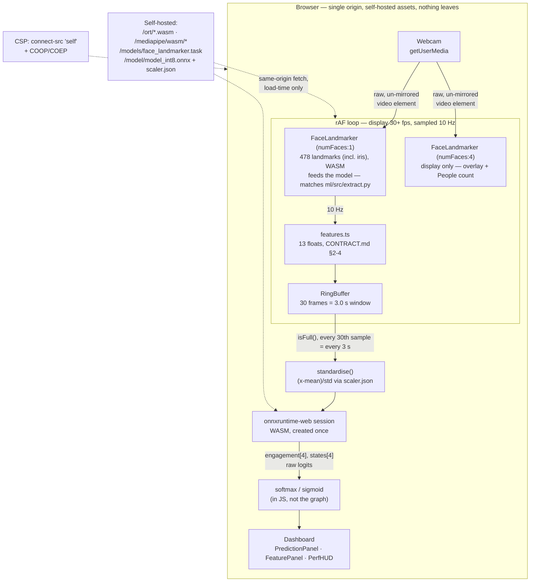

# Architecture — Track B

Everything below runs **inside the browser tab**. There is no server
component to this pipeline — see `docs/privacy.md` for the proof.

## Stage by stage

| Stage | File | What it does |
|---|---|---|
| Capture | `components/WebcamFeed.tsx` | `getUserMedia`, raw un-mirrored frame fed to the landmarker (mirroring is CSS-only, for display); handles denied/no-camera/busy/unsupported/no-API as real UI states, not crashes |
| Detect | `lib/faceLandmarker.ts` | Two MediaPipe `FaceLandmarker` instances, both pinned to the **CPU delegate** (XNNPACK) — required for J1 parity, see CONTRACT.md Amendment 2 — and both self-hosted (`.task` model + WASM, never hotlinked): `createFeatureLandmarker()` (`numFaces: 1`) is the only one ever fed into `computeFeatures()`; `createDisplayLandmarker()` (`numFaces: 4`) drives the on-screen multi-face overlay + "People" count only. Kept separate because `numFaces > 1` measurably shifts landmarks enough to fail J1 on blink frames |
| Extract | `lib/features.ts` | The 13-float feature vector, ported line-for-line from CONTRACT.md §2–4, computed from `createFeatureLandmarker()`'s output only. `LandmarkDebugOverlay.tsx` visualizes the exact same index constants this file exports, for the Day-3 visual verification step |
| Buffer | `lib/ringBuffer.ts` | Fixed `Float32Array(30×13)`, push-and-evict, `isFull()` guard so inference never runs on a partial window |
| Standardise | `lib/mathUtils.ts`, `lib/scaler.ts` | `(x − mean) / std` per feature, using `scaler.json`; `validateScaler()` throws on `feature_names` mismatch rather than running on silently-wrong data |
| Infer | `lib/inference.ts` | onnxruntime-web WASM session, created once (never per frame); loaded via a runtime `import()` of the self-hosted `/ort/ort.wasm.min.mjs`, not a bundled static import — see the comment in that file for why |
| Postprocess | `lib/mathUtils.ts` (`softmax`/`sigmoid`) | Applied in JS — the ONNX graph outputs raw logits only, per CONTRACT.md §5 |
| Display | `hooks/usePipeline.ts`, `components/CognitiveApp.tsx` and its child panels | Wires the above into React state; status is *derived* from `modelsReady`/`cameraReady`/`prediction` rather than imperatively set, so the two independent async chains (camera, model loading) can't race and leave a stale status badge |

## Timing, per CONTRACT.md §6

Three distinct rates, reported separately in `PerfHUD.tsx` because they
genuinely differ:

- **Display**: uncapped, driven by `requestAnimationFrame` (30+ fps)
- **Sampling**: throttled to 10 Hz inside the same rAF loop
- **Inference**: every 30th sample once the buffer is full → one prediction per 3 s (CONTRACT.md §6 Amendment 1)

## Why the model loads via a runtime `import()`, not a static one

`onnxruntime-web`'s own `.mjs` distributables (any entry point — the
umbrella package, `/wasm`, `/webgpu`) fail production Terser minification
when webpack statically bundles them; they use `import.meta`/dynamic-import
patterns the asset pipeline mishandles. The library dodges this for its
*own* internal dynamic imports with a `webpackIgnore` comment — `lib/inference.ts`
applies the same trick one level up, loading the copy already self-hosted
under `/ort/` as a genuine browser runtime import webpack never touches.
Types still come from the package via `import type`, which is fully erased
at compile time and can never trigger the bundling bug.

## Why the dashboard is `next/dynamic(..., { ssr: false })`

Next.js server-renders `'use client'` pages by default. There's no reason
to server-render a page whose entire content is "wait for camera + WASM,"
and doing so is what caused the bundling problem above in the first place —
the server pass tried to import `onnxruntime-web`/`@mediapipe/tasks-vision`
too. `app/page.tsx` loads the real dashboard (`components/CognitiveApp.tsx`)
through a client-only dynamic import so that module graph never reaches the
server bundle at all.
